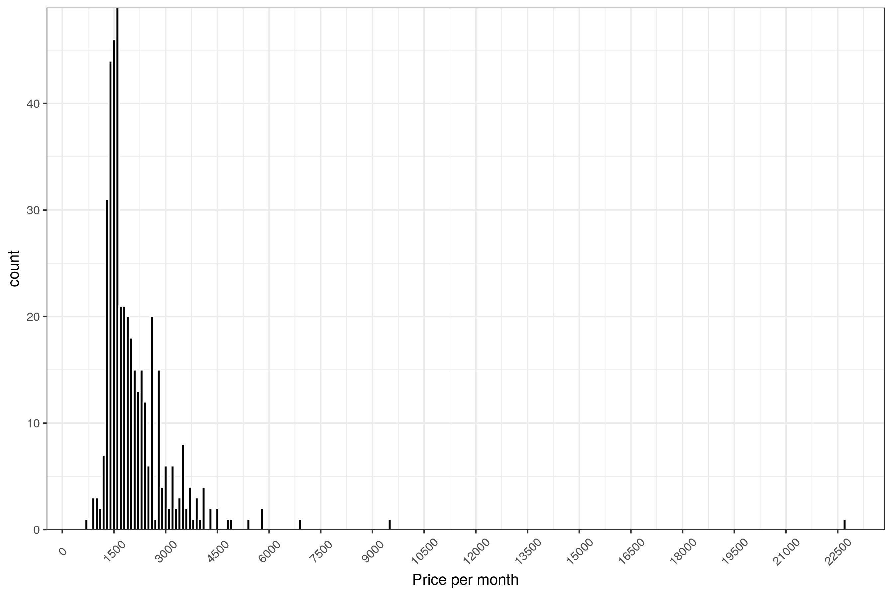

# rent-distribution
I wrote this while looking at properties on Zoopla. It is just a small project to get an idea of the price distribution of a certain type of property in a given area.

## Load libraries
```R
library(rvest); library(ggplot2)
```
## Get webpage
```R
# Property to rent near King's Cross, all results (29th Jan 2017)
webpage <- read_html("http://www.zoopla.co.uk/to-rent/property/london/kings-cross/?include_shared_accommodation=false&price_frequency=per_month&q=Kings%20Cross%2C%20London&results_sort=newest_listings&search_source=to-rent&page_size=500")

# getting prices. Element selected by using the following javascript:
# javascript:(function()%7Bvar%20s=document.createElement('div');s.innerHTML='Loading...';s.style.color='black';s.style.padding='20px';s.style.position='fixed';s.style.zIndex='9999';s.style.fontSize='3.0em';s.style.border='2px%20solid%20black';s.style.right='40px';s.style.top='40px';s.setAttribute('class','selector_gadget_loading');s.style.background='white';document.body.appendChild(s);s=document.createElement('script');s.setAttribute('type','text/javascript');s.setAttribute('src','https://dv0akt2986vzh.cloudfront.net/unstable/lib/selectorgadget.js');document.body.appendChild(s);%7D)();
prices <- webpage %>% html_nodes(".text-price") %>% html_text()

# getting addresses
addresses <- webpage %>% html_nodes(".listing-results-address") %>% html_text()
```
## Clean up
```R
clean.string <- NULL
for (i in 1:length(prices)) {
  clean.string <- append(clean.string, strsplit(prices, "£")[[i]][[2]])
}

prices <- as.numeric(gsub("[^0-9]", "", clean.string)); rm(clean.string); rm(i)

roads <- gsub("^\\s*", "", gsub("[0-9]*", "", gsub(",.*$", "", gsub("\n*(\\s)*$", "", gsub("^\n*(\\s)*", "", addresses))))); rm(addresses)

properties <- data.frame(prices = prices,
                         roads = as.factor(roads))
head(properties)
```
```
#   prices              roads
# 1   2492          Ice Wharf
# 2   1603 Cartwright Gardens
# 3   1907      Brownlow Mews
# 4   1907      Brownlow Mews
# 5   3467           Arthouse
# 6   1387       Albany House
```
```R
rm(prices, roads, webpage)

saveRDS(properties, file = paste0(Sys.Date(), " King's Cross.rds"))

plot.h <- function(input) {
  ggplot(as.data.frame(input), aes(as.data.frame(input))) + 
    geom_histogram(binwidth = 100, fill = "black", col = "white") +
    scale_x_continuous("Price per month", 
                       breaks = c(seq(from = 0, to = max(input), by = 1500))) +
    scale_y_continuous(expand = c(0, 0)) +
    theme_bw() +
    theme(axis.text.x = element_text(angle = 45, vjust = 0.5))
} 
```
## Get insights
```R
plot <- plot.h(properties$prices)

plot
```

```R

ggsave(plot, filename = paste0(Sys.Date(), " King's Cross.png"))

summary(properties$prices)[c(1, 4, 6)]
```
```
# Min.  Mean  Max. 
#  700  2120 22750
```
